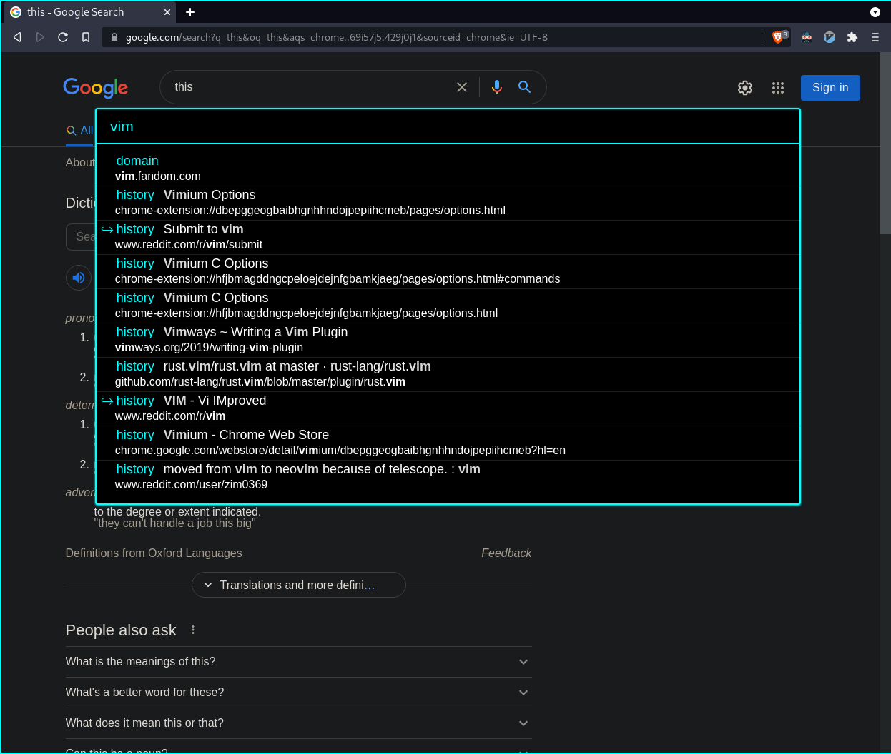
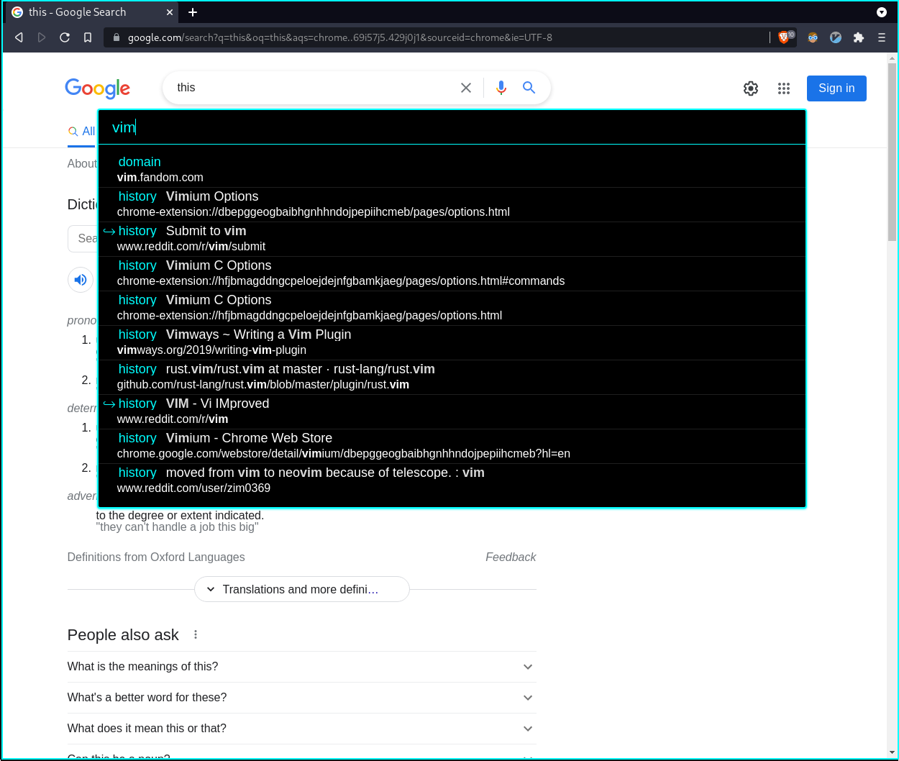
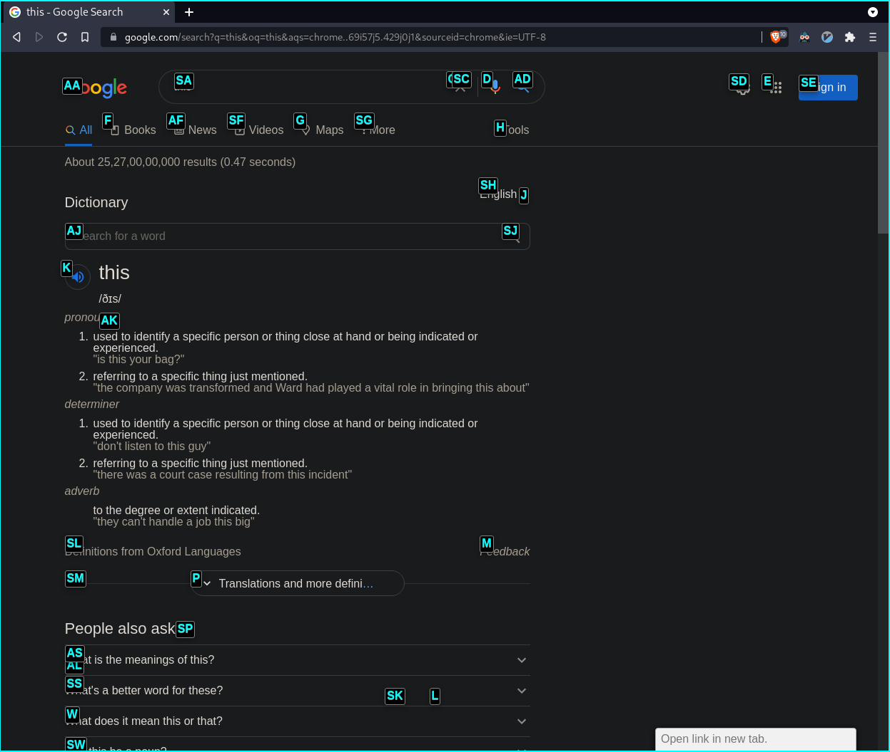
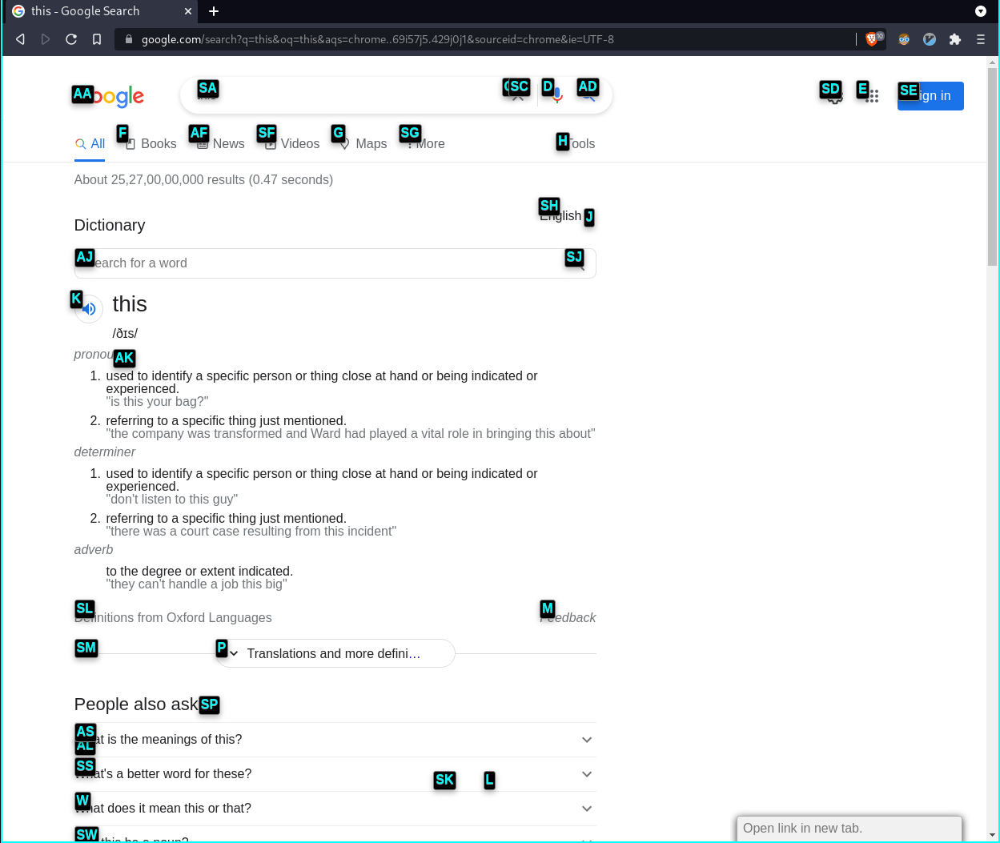

# vimium.css

### Dark theme for vimium vomnibar and vimium hint markers.

Copy the vimium.css file to the 'custom css' pane in vimium's options menu. 

For search engine prefixes in vomnibar, copy the vimium.search file to the 'custom search engines' pane in vimium's options menu.

Looking for `vimiumC`? [Check here](https://github.com/zim0369/vimiumC.css)

